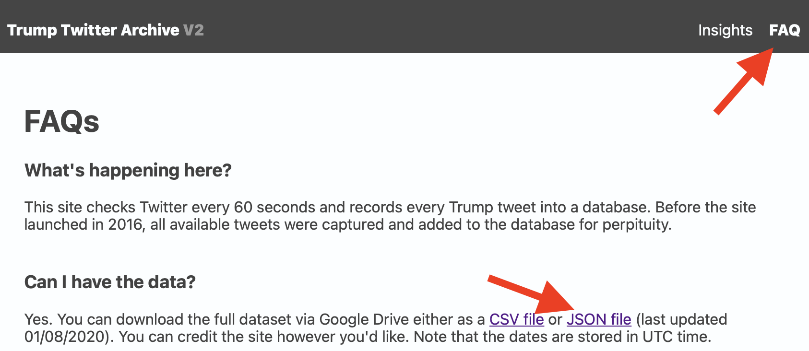

# Cours AP – groupes débutants - TP 3

Bonjour à tous, ce dépôt présente un sujet de TP à destination des groupes débutants, qui s'oriente à dessein vers une approche plus "appliquée" des grands principes du langage Python.

Afin de profiter au mieux de ce cours, vous êtes invités à suivre le cheminement proposé ci-dessous:

## Prérequis: Installation

Nous allons utiliser un **environnement `conda`** afin d'**isoler** les dépendances de ce projet vis-à-vis des autres sujets de TP.

Afin de simplifier l'installation, un fichier `environment.yml` est fourni, il permet de générer un nouvel environnement nommé `aptp3` pré-configuré.
Il s'utilise comme suit:

```shell script
# on commence par charger le fichier, ce qui va créér l'environnement et télécharger tout ce qui est nécessaire au TP
conda env create -f environment.yml

# puis on n'oubiera pas d'ACTIVER le nouvel environnement
conda activate aptp3
```

## Première partie

Ce TP va nécessiter le téléchargement de la base de données "Trump Tweet Archive V2" disponibles sur le site [https://www.thetrumparchive.com](https://www.thetrumparchive.com/).

Vous devrez la télécharger au **format JSON** en allant sur l'onglet FAQ et en cliquant sur le lien idioine:



Ouvrez ensuite 